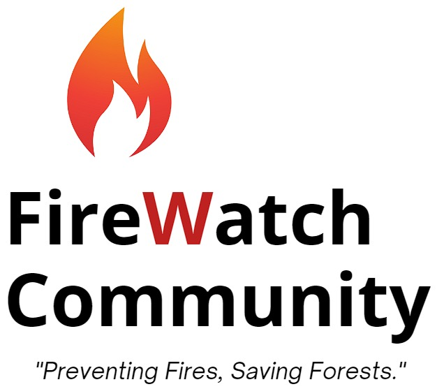
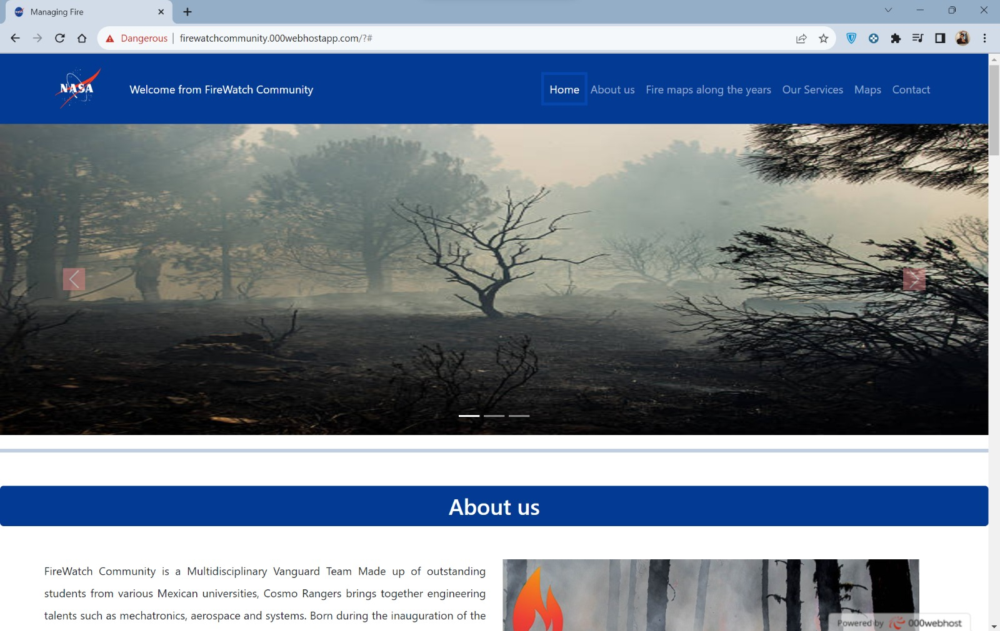
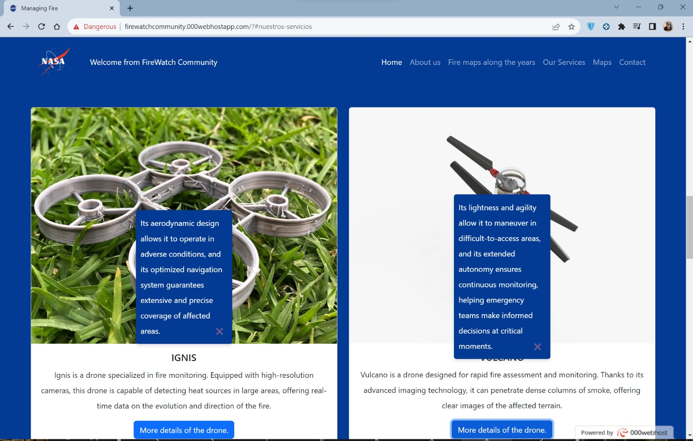
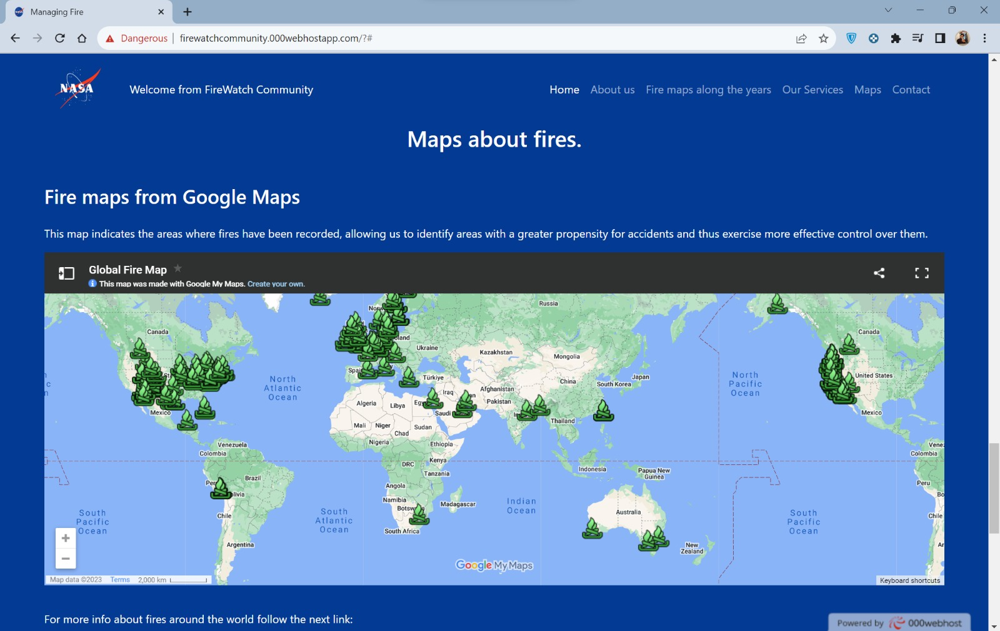
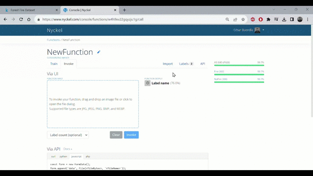

# NASA SpaceApss Challenge 2023 🚀

**Challenge:** Managing Fire: Increasing Community-based Fire Management Opportunities
[**Link**](https://www.spaceappschallenge.org/2023/challenges/managing-fire-increasing-community-based-fire-management-opportunities/) 

# Project Proposal: FireWatch Community
 
**[Presentation](https://www.canva.com/design/DAFwsi_vuP8/rzOza61muPKYi0ioSyUqtw/edit?utm_content=DAFwsi_vuP8&utm_campaign=designshare&utm_medium=link2&utm_source=sharebutton)**  
## Our Work
### App Prototipe

Our app uses an interactive map for real-time fire alerts. If you see a fire, take a photo, which our image recognition algorithm will analyze to avoid false alarms, effectively identifying and monitoring fires.

It also offers an emergency button and an awareness tab with infographics about forest fires.

### Web Prototipe

)
)
**[Website](https://firewatchcommunity.000webhostapp.com/)**
Where you will find a historical map of forest fires and valuable information on how to act in the event of one.

In addition, having drone prototyping and image recognition for effective identification and monitoring of forest fires.

### IR Prototipe

An image recognition algorithm that processes user captures through the mobile app, then extracts features and classifies the images as "Fire" or "No fire."
If a fire is detected, an alert is issued for response action

### Drone monitoring Prototipe
*Enruteo de imagen del dron sin fondo*

**Check out our [presentation](https://www.canva.com/design/DAFwsi_vuP8/rzOza61muPKYi0ioSyUqtw/edit?utm_content=DAFwsi_vuP8&utm_campaign=designshare&utm_medium=link2&utm_source=sharebutton)!** 

## Technologies🛠️
- React Native Expo,
- Nyckel (IR)
- HTML/JS/CSS
- 000webhost
- SolidWorks
- UltiMaker Cura

## Areas📋
- Logistics
- Design
- Science
- Healt

## Team
- Domínguez Chimal Oswaldo Raúl
- Buendía Galvan Cesar Gerardo
- Jeronimo Barrientos Kevin Angel
- Moreno López David Jesús
- Nogales Badillo Cinthya
- Boza Zabarburú Aracelli Melissa
